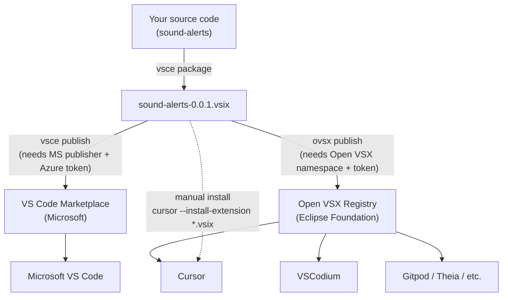

# Extension marketplaces: VS Code Marketplace vs Open VSX

A quick mental model for *how an extension gets from your machine into someone
else's editor* — and why **Cursor uses Open VSX**.

## The big picture

A VS Code–style extension is just a packaged file: a **`.vsix`** (a zip of your
`extension.js`, `package.json`, icon, etc.). On its own, a `.vsix` is something
you have to install by hand. To make it **searchable + one-click installable**
from inside an editor, you upload it to an online **registry**.

There are two registries, and which one an editor uses is the whole crux:

## Why two registries exist

The **VS Code Marketplace** is Microsoft's. Its Terms of Use legally restrict it
to *"in-product acquisition... for Visual Studio and Visual Studio Code"* — i.e.
Microsoft's own builds. Editors that are **forks** of VS Code's open-source core
(Cursor, VSCodium, Gitpod, Eclipse Theia…) are **not allowed** to use it.

To fill that gap, the **Eclipse Foundation** runs **Open VSX** — an open,
vendor-neutral registry that any editor can use. That's why:

| Editor | Pulls extensions from |
| --- | --- |
| Microsoft VS Code | VS Code Marketplace |
| **Cursor** | **Open VSX** |
| VSCodium | Open VSX |
| Gitpod / Theia | Open VSX |

So when you click "Install" inside **Cursor's** Extensions panel, it's querying
**Open VSX** — not Microsoft's marketplace.

## The two CLI tools

| Tool | Publishes to | In this project |
| --- | --- | --- |
| `vsce` (`@vscode/vsce`) | VS Code Marketplace | `npm run package`, `npm run publish:vsce` |
| `ovsx` | Open VSX | `npm run publish:ovsx` |

Both also build/validate the `.vsix`. You only *need* `ovsx` for Cursor.

## Key terms

- **`.vsix`** — the packaged extension file (one build, publishable anywhere).
- **Publisher / namespace** — your identity on a registry (here: `dshashikk`).
  On Open VSX you create it once with `ovsx create-namespace dshashikk`.
- **Access token** — authorizes publishing under your namespace. On Open VSX:
  open-vsx.org → Settings → Access Tokens. Keep it secret (we store it as the
  `OVSX_TOKEN` GitHub Actions secret so CI can publish on a tag).
- **GitHub ≠ a registry** — pushing code to GitHub does **not** make it
  installable in an editor. GitHub hosts the *source*; the registry hosts the
  *installable package*. (You *can* attach a `.vsix` to a GitHub Release for
  manual installs, which the release workflow does.)

## What this means for sound-alerts

1. Source lives on GitHub: `github.com/dshashikk/sound-alerts`.
2. To make it installable in **Cursor**, publish the `.vsix` to **Open VSX**
   under the `dshashikk` namespace (manually, or automatically via the release
   workflow when `OVSX_TOKEN` is set).
3. Publishing to the Microsoft Marketplace is **optional** — only needed if you
   also want plain VS Code users to find it by search.
